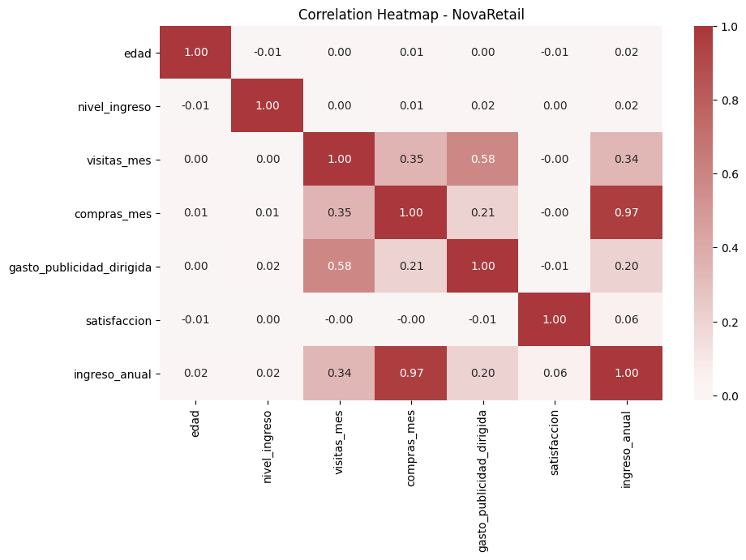
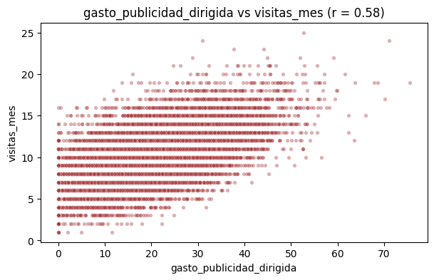
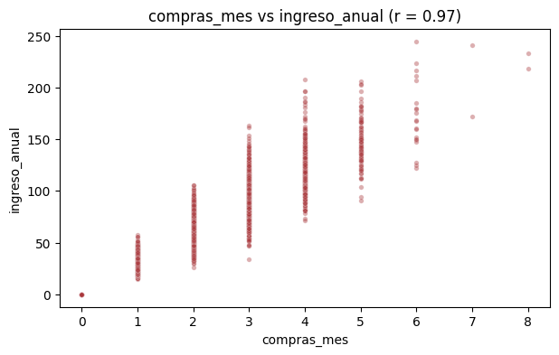

# Factores de comportamiento asociados al ingreso en NovaRetail+

Análisis de correlación sobre 15.000 clientes de una plataforma de comercio electrónico en Latinoamérica. El equipo de Crecimiento y retención quiere saber qué comportamientos del cliente se asocian más con el ingreso anual que genera.

**Resultado principal:** la publicidad dirigida se asocia con más visitas, pero mucho menos con más compras, y la membresía premium es la única variable relacionada con el abandono. El perfil del cliente (edad, nivel de ingreso, región y dispositivo) no muestra relación con el ingreso.

[Ver el notebook](analisis_novaretail.ipynb) · [Abrir en Google Colab](https://colab.research.google.com/github/fvt1999pipe-eng/analisis_novaretail/blob/main/analisis_novaretail.ipynb)

## Pregunta de negocio

¿Qué factores del comportamiento del cliente están más fuertemente asociados con el ingreso anual generado?

El análisis es exploratorio: describe asociaciones entre variables y no demuestra causalidad. Por eso cada hallazgo se acompaña de lo que los datos no permiten afirmar.

## Resultados

| Hallazgo | Evidencia | Lectura para el negocio |
|---|---|---|
| Las compras al mes y el ingreso anual miden casi lo mismo | Pearson 0,967 y Spearman 0,967 | Son variables redundantes: conviene elegir una sola como métrica principal. |
| La publicidad dirigida se asocia con las visitas más que con las compras | Con visitas: Pearson 0,579 y Spearman 0,559. Con compras: Pearson 0,21 | Antes de mover presupuesto, validar con una prueba A/B si las visitas se convierten en compras. |
| Los clientes premium abandonan menos | V de Cramér 0,120. Abandono de 4,4% en premium frente a 16,8% en no premium | Es la única variable asociada al abandono; hay que analizarla por cohortes antes de atribuirle el efecto. |
| El perfil del cliente no se asocia con el comportamiento | Edad, nivel de ingreso y satisfacción: Pearson entre -0,01 y 0,06. Región y dispositivo: V de Cramér menor a 0,02 | No hay evidencia para priorizar ni excluir segmentos por edad, ingreso, región o dispositivo. |



*Mapa de correlaciones. Casi todos los coeficientes están cerca de 0; destacan compras e ingreso (0,97) y publicidad y visitas (0,58).*



*Publicidad dirigida y visitas al mes. La tendencia es ascendente, pero con mucha dispersión: con un gasto de 20, las visitas van de 3 a 20.*



*Compras al mes e ingreso anual. La relación es lineal y escalonada, y con 0 compras el ingreso siempre es 0: una variable se deriva de la otra.*

### Recomendaciones

1. Usar una sola métrica entre `ingreso_anual` y `compras_mes` en segmentaciones y modelos, y confirmar cómo se calcula el ingreso.
2. Medir con una prueba A/B el efecto real de la publicidad dirigida sobre las visitas y las compras.
3. Estudiar el paso de visita a compra, que es donde la relación se debilita.
4. Analizar el abandono por cohortes y antigüedad, y probar con un piloto si incentivar la membresía premium se asocia con menor abandono.
5. Revisar cómo se mide la satisfacción, que no mostró relación con el abandono.

## Datos

| Archivo | Filas | Contenido |
|---|---|---|
| `novaretail_comportamiento_clientes_2024.csv` | 15.000 | Un registro por cliente con 12 columnas: perfil (edad, nivel de ingreso, región y dispositivo), actividad (visitas y compras al mes, gasto en publicidad dirigida y satisfacción), estado (membresía premium y abandono) e ingreso anual generado. |

Los datos son un caso de estudio del bootcamp de Análisis de Datos de TripleTen y no se incluyen en el repositorio.

## Metodología

1. **Exploración:** estructura, tipos de datos y valores faltantes.
2. **Preparación:** corrección de tipos y diagnóstico de las variables numéricas, binarias y categóricas, con detección de valores atípicos por la regla IQR.
3. **Supuestos:** qué mide cada coeficiente y qué no se puede concluir de un análisis correlacional.
4. **Visualización:** mapa de calor, matriz de diagramas de dispersión y detalle de los pares con la relación más fuerte.
5. **Coeficientes según el tipo de variable:**

   | Variables | Coeficiente |
   |---|---|
   | Numérica y numérica | Pearson y Spearman |
   | Numérica y binaria | Punto-biserial |
   | Categórica y categórica | V de Cramér, con una función propia sobre chi-cuadrado |

6. **Interpretación para el negocio:** cada hallazgo con su evidencia, lo que no se puede afirmar y su implicación.
7. **Limitaciones y próximos pasos.**

## Estructura del repositorio

```
analisis_novaretail/
├── analisis_novaretail.ipynb   Notebook con el análisis completo
├── img/                        Gráficos usados en este README
├── requirements.txt            Librerías necesarias
└── README.md
```

## Cómo reproducir el análisis

1. Clona el repositorio e instala las librerías:

   ```bash
   git clone https://github.com/fvt1999pipe-eng/analisis_novaretail.git
   cd analisis_novaretail
   pip install -r requirements.txt
   ```

2. Crea una carpeta `datasets/` junto al notebook y copia en ella el archivo CSV.
3. Abre `analisis_novaretail.ipynb` en Jupyter y ejecuta las celdas en orden.

En Google Colab, sube el archivo a una carpeta `datasets/` desde el panel **Archivos** antes de ejecutar el notebook.

## Herramientas

Python · pandas · NumPy · SciPy · Matplotlib · Seaborn · Jupyter

## Autor

**Felipe Vásquez Torres**, analista de datos con experiencia en supply chain y operaciones.

[LinkedIn](https://www.linkedin.com/in/felipe-vasquez-torres) · [Portafolio](https://fvt1999pipe-eng.github.io) · fe.vasqueztorres@gmail.com
